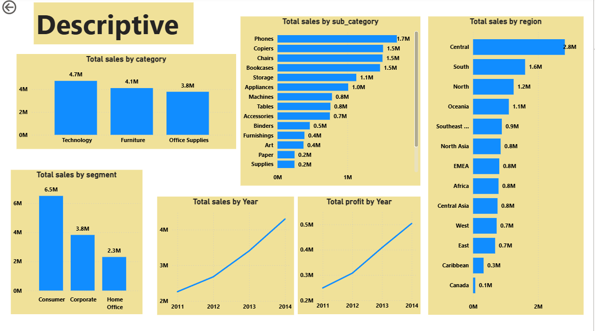
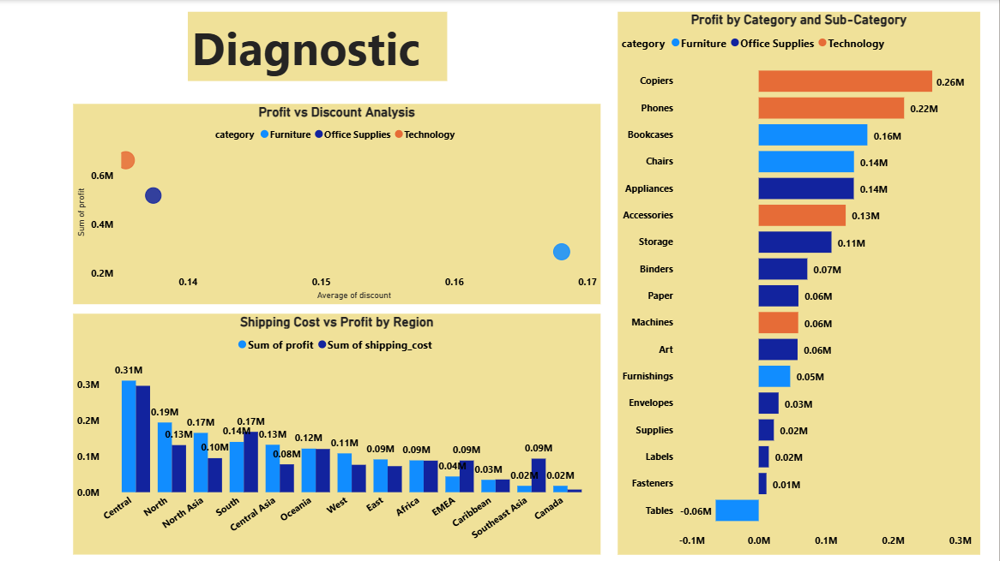
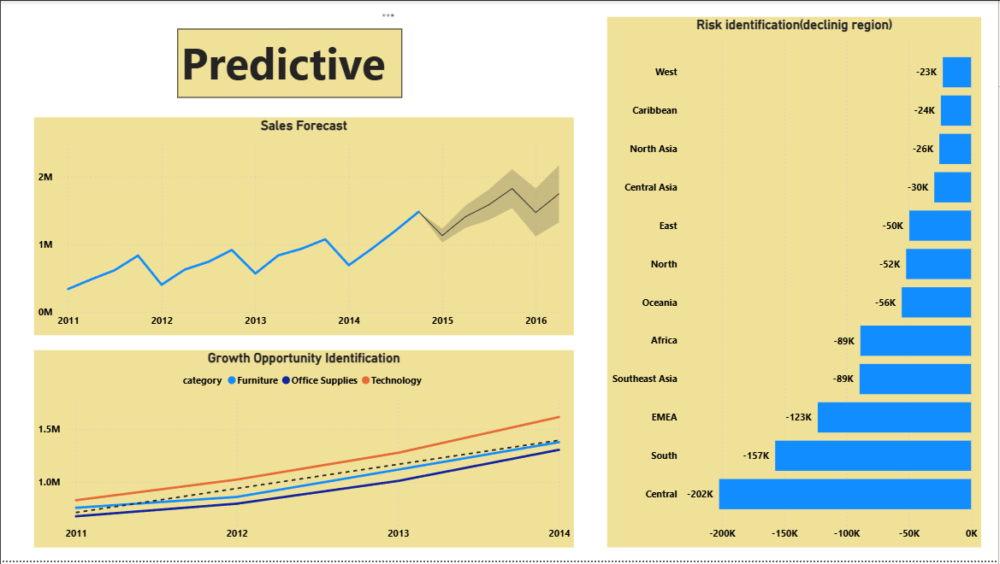

#  Global Retail Analysis: End-to-End Power BI Project

##  Project Overview
This project transforms a Global Retail dataset into a multi-layered analytical tool. It covers the full spectrum of data analysis: **Descriptive** (what happened), **Diagnostic** (why it happened), and **Predictive** (what will happen).

## Analytical Layers

### 1. Descriptive Analytics (Market Overview)
Focuses on historical sales performance across regions and segments.
* **Total Sales:** $13M | **Total Profit:** $1.47M
* **Key Insight:** The **Consumer Segment** is the largest driver of revenue ($6.5M).

### 2. Diagnostic Analytics (Profitability Drivers)
Analyzes the relationship between shipping costs, discounts, and profit.
* **Key Insight:** **Tables** are currently a loss-leader (-$0.06M profit), likely due to high shipping costs in the Central region.

### 3. Predictive Analytics (Forecasting)
Uses historical trends to forecast future sales and identify risks.
* **Growth Opportunity:** Technology continues to show the strongest upward trajectory.
* **Risk ID:** Identifying declining regions to prevent future revenue churn.

## 🛠️ Skills Demonstrated
* **Advanced DAX:** Calculations for Average Shipping Cost and Total Profit.
* **Data Storytelling:** Structured the report to guide stakeholders from overview to action.
* **Trend Forecasting:** Implementing built-in Power BI analytics for sales projections.
